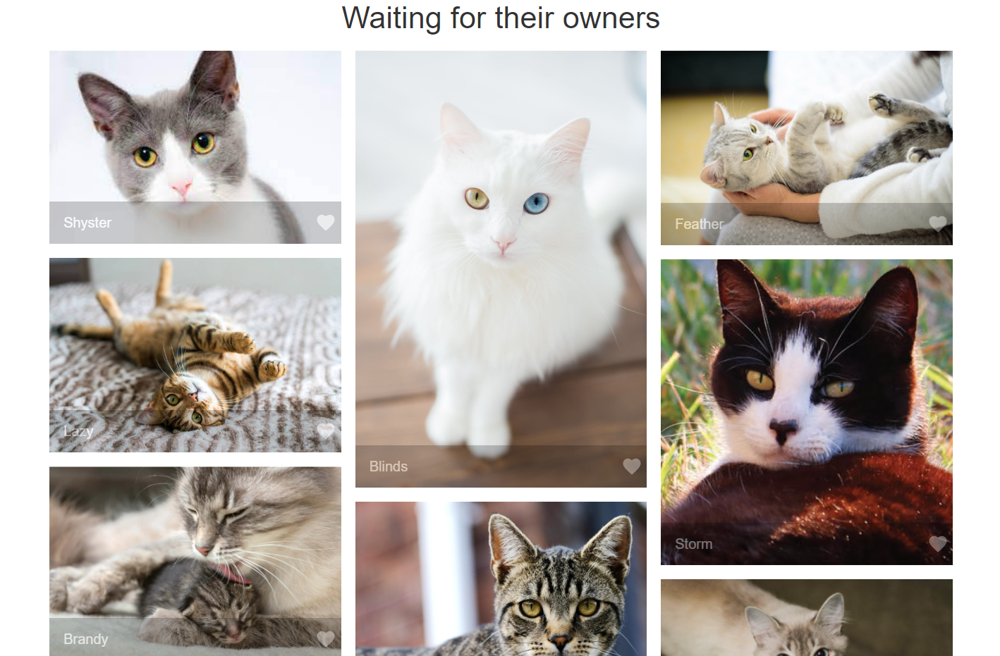
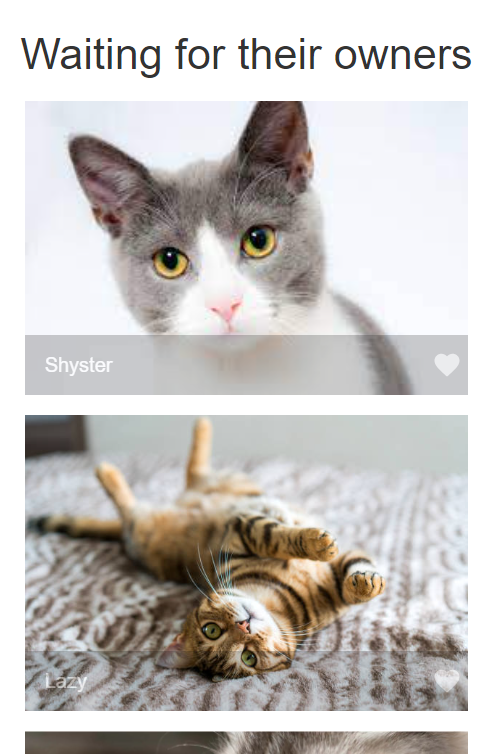
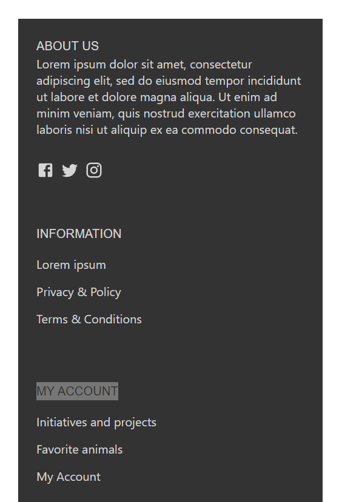

# Material UI

## General
Please, create an application with the following structure of elements:

 
  

## 1. Header
for screen size 1200px and more should contain title, menu and action buttons as shown below:

for [900px - 1200px) is similar, but space between action buttons is smaller:

for less than 900px menu should hide and be avaliable via **menu** button, and action buttons are not in the header and title should appear in the center:

## 2. Menu
Menu should have elements as shown below for screens 900 px and bigger. Stories item should have submenu

for less than 900px menu should open on click on **menu** button . Stories item should have submenu (use Accordion component for that):

## 3. Banner
Banner should contain 
 - image (you can use any pictue). Change image size accordingly to the size of the screen (you can choose size values)
 - 3 text elements with different sizes (use Typography component for this),
 - button **Donate** - customize it so that it looks like shown below (size, sharp edges, change text color on hover)

for screen size less than 600px image and text elements should be aligned vertically:

## 4. Content
Dilplay elements like on the screen below for screens 900 px and bigger:
(elements should be placed in 3 cfolumns)

You can use any pictures you like.
  
for [600px - 900px) elements should be placed in two columns:

  
for less than 600px screen size elements should be placed in one column:

On each item should be a caption and *faforite* button customized as ahown below:

## 5. Footer
Sould consist of 3 sections: ABOUT US, INFORMATION, MY ACCOUNT.
for screen size 1200px and more it should look like this:

 
for [600px - 1200px):

 
for less than 600px:

 

## 6. Action icons

for screen size 900 and more - explained in section **Header**
 
for less than 900px action items should be placed at the bottom of the screen:

  

## 7. Customization
At least one component should be overriden (customized) at theme level.  
Palette should be overriden (customized) at theme level.  
Use styles/index.js for the theme customization.  
      
    
## *Note*
*Not all of the requirements are tested by unit tests, but still, try to implement all of them.* 
*If you have ideas what else would be good to add, you are welcome to do it in addition to existing requirements.*  
*You can use the colors that are defined in styles/index.js. Also, you can change values of the colors to your liking. But please, not use the default color scheme*
